# 一、SpringCloud Eureka 服务注册与发现
## 1.服务段模块添加相关依赖
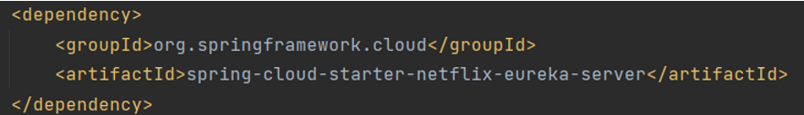
## 2.服务端在启动类上添加@EnableEurekaServer注解
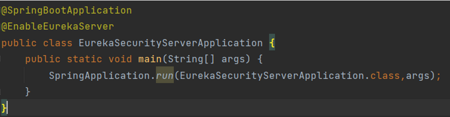
## 3.服务端在配置文件中配置eureka相关信息
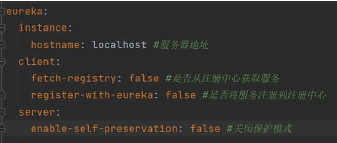
## 4.客户端模块添加相关依赖
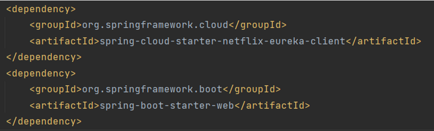
## 5.客户端在启动类上添加@EnableEurekaClient注解
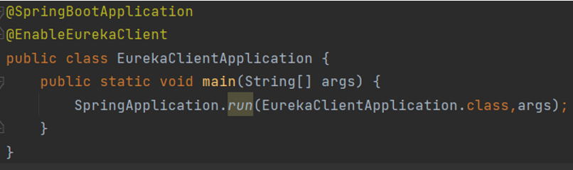
## 6.客户端在配置文件中配置eureka相关信息
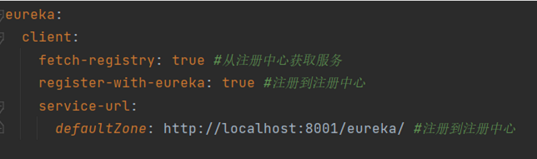
## 7.启动服务端和客户端，访问服务端端的服务地址，可以看到客户端被注册
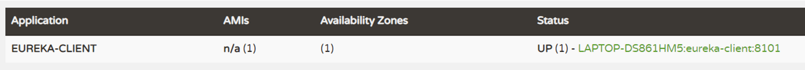
## 8.使用三个不同配置文件运行实例，分别指定hostname和port，分别启动
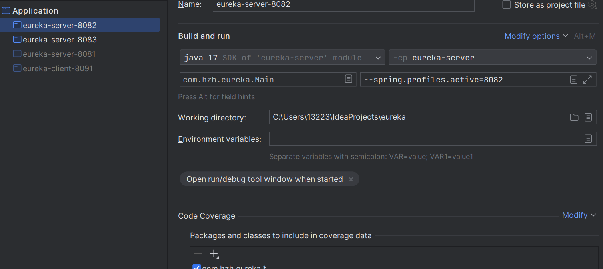
## 9.访问服务端的服务地址，可以看到三个客户端被注册
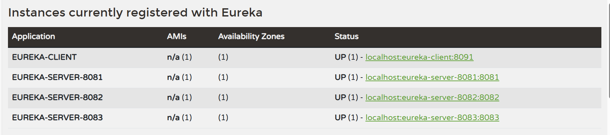
```agsl
学习总结：在微服务架构中往往会有一个注册中心，每个微服务都会向注册中心去注册自己的地址及端口信息，
注册中心维护着服务名称与服务实例的对应关系。每个微服务都会定时从注册中心获取服务列表，同时汇报自己的运行情况，
这样当有的服务需要调用其他服务时，就可以从自己获取到的服务列表中获取实例地址进行调用，Eureka实现了这套服务注册与发现机制。
```
# 二、SpringCloud Ribbon 负载均衡
## 1.创建ribbon-service模块和user-service模块，均导入eureka-client依赖（由于新版本的eureka-client自带ribbon，所以不需要再导入ribbon依赖）
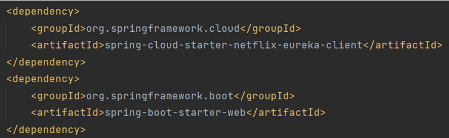
## 2.ribbon-service和user-service模块在启动类上添加@EnableDiscoveryClient注解
## 3.ribbon-service模块在配置文件中配置eureka相关信息,指定user-service的服务地址并启动user-service的负载均衡为随机
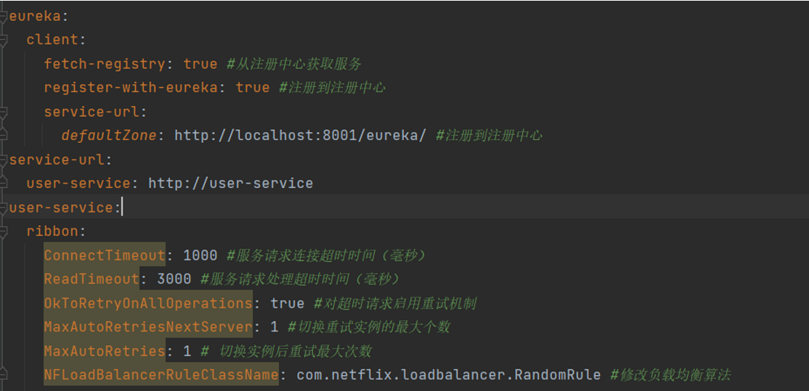
## 4.ribbon-service模块创建RestTemplate的bean，并添加@LoadBalanced注解
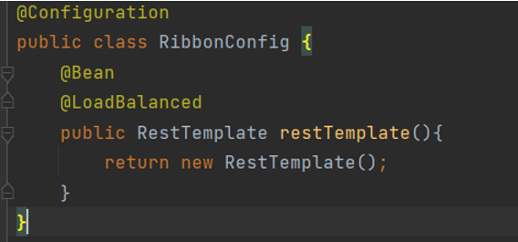
## 5.ribbon-service模块创建UserRibbonController类，通过RestTemplate调用user-service的接口
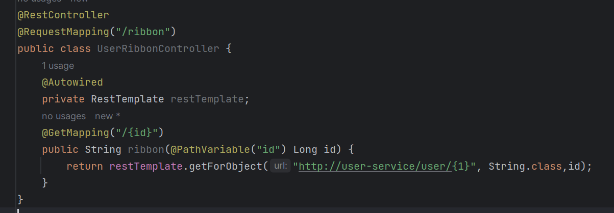
## 6.user-service模块创建UserController类，提供接口
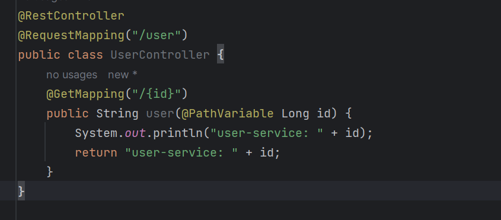
## 7.启动eureka-server、ribbon-service，启动两个user-service实例，访问ribbon-service的接口，可以看到负载均衡效果是随机的
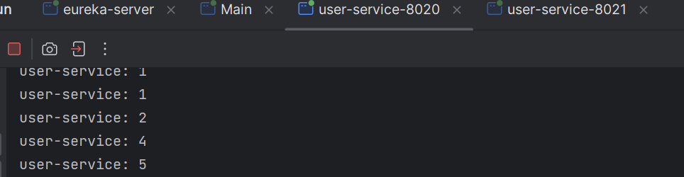
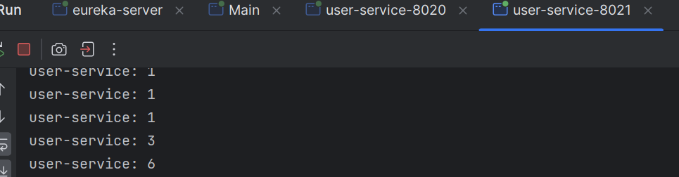

```agsl
学习总结：在微服务架构中，很多服务都会部署多个，其他服务去调用该服务的时候，
如何保证负载均衡是个不得不去考虑的问题。负载均衡可以增加系统的可用性和扩展性，
当我们使用RestTemplate来调用其他服务时，Ribbon可以很方便的实现负载均衡功能。
```
# 三、SpringCloud Feign 声明式服务调用以及服务降级
## 1.创建resilience4j-service模块，导入相关依赖
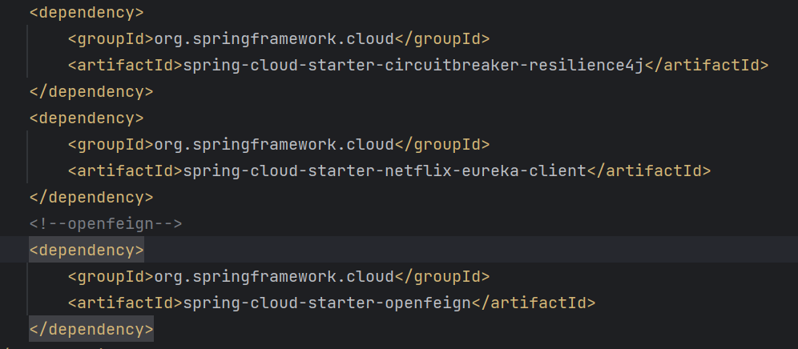
## 2.配置文件中配置resilience4j相关信息
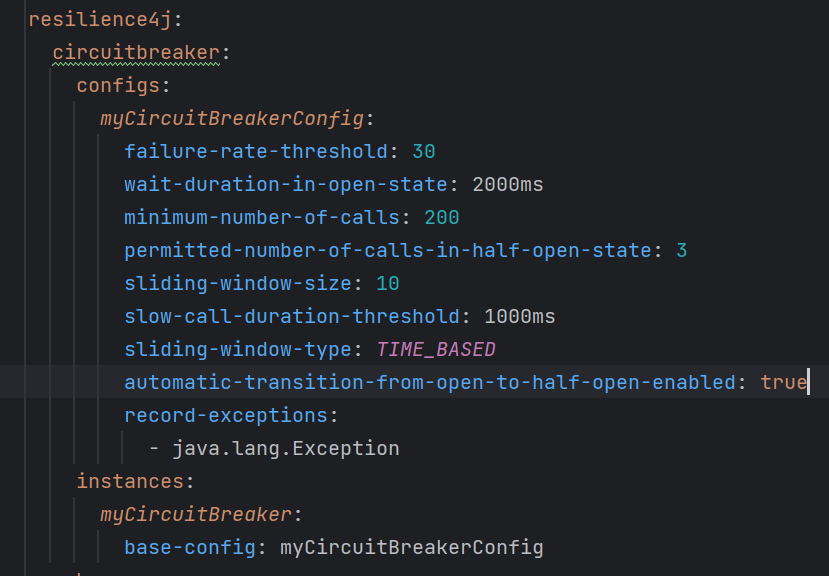
## 3.创建UserClient接口用于声明式服务调用，并指定fallback类或方法
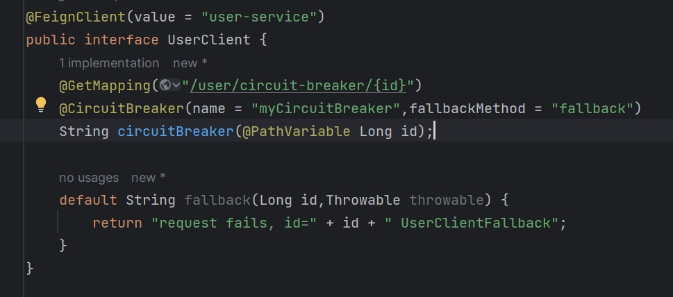
## 4.创建UserController类，使用UserClient接口进行服务调用
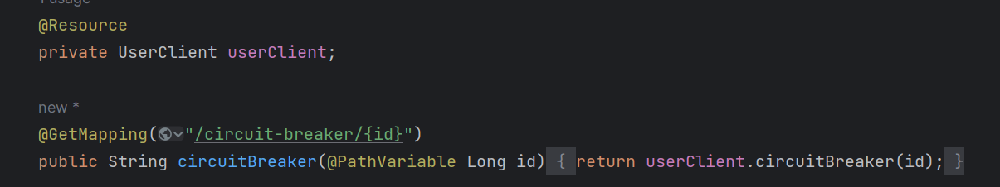
## 5.可以看到服务调用成功，并且打印了fallback的信息

## 6.在ribbon-service中使用loadbalancer进行服务调用，使用随机算法，调用10次，可以看到负载均衡效果
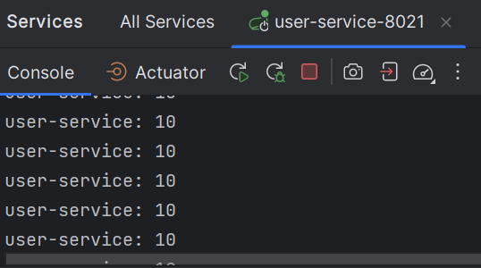
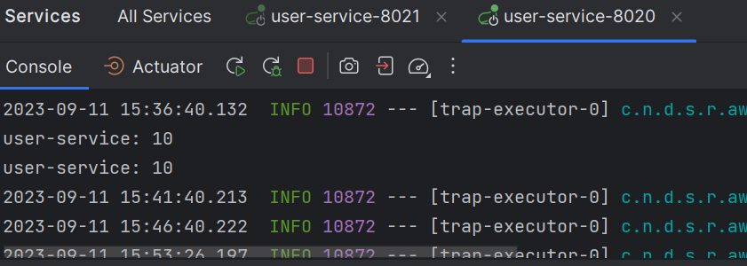


